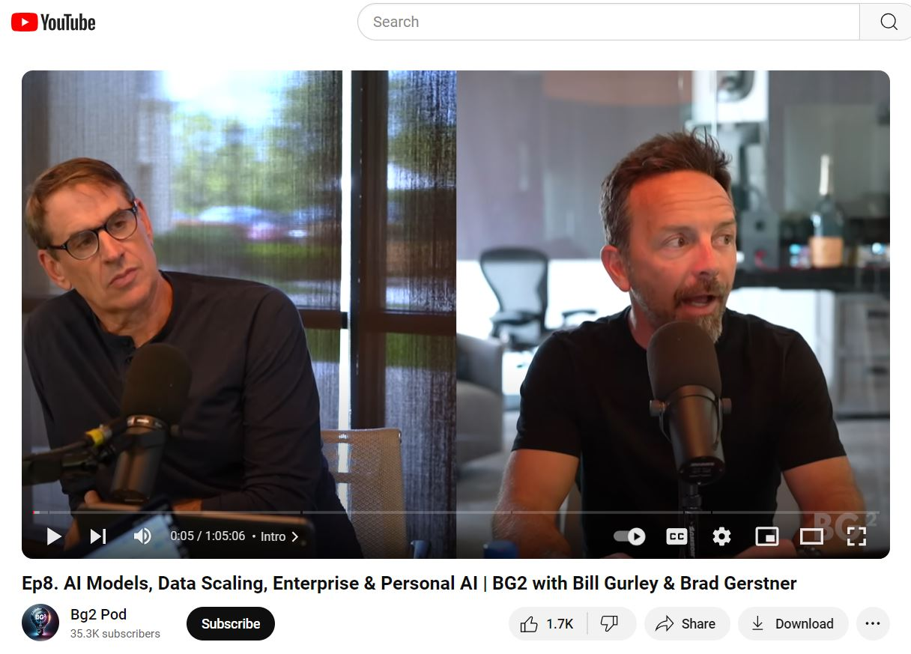

# Portrait Video Generator from Landscape Video

This repository contains a Python project that converts landscape videos into portrait format (9:16) by using OpenAI's API to extract the most relevant segments of the video. The application then focuses on the speaker using a face and mouth detection model to detect who's speaking and crops the video accordingly.

## Features

- **Segment Identification**: Automatically selects the most viral and engaging sections of the video using OpenAI's API.
- **Face and Mouth Detection**: Identifies the speaker and crops the video around their face and mouth, focusing on the person speaking.
- **9:16 Aspect Ratio Conversion**: Crops the landscape video into a 9:16 portrait format.
- **Audio/Video Synchronization**: Maintains the original audio track while synchronizing with the cropped video.

## Requirements

To run the project, you'll need the following dependencies:

- Python 3.x
- `opencv-python`
- `ffmpeg-python`
- `moviepy`
- `tqdm`
- `openai`
- `numpy`
- `youtube-transcript-api`

You can install these dependencies using `pip`:

```bash
pip install opencv-python ffmpeg-python moviepy tqdm openai numpy youtube-transcript-api
```
## Setup

### 1. OpenAI API Key: 
You'll need an API key from OpenAI to use GPT for extracting relevant video segments. Add your API key to the ```openai.api_key``` variable in the code:
```python
openai.api_key = 'your-api-key-here'
```
### 2. Face Detection Model:
Download the face detection model and place it in your working directory. The model consists of:
- ```deploy.prototxt```
- ```res10_300x300_ssd_iter_140000.caffemodel```
- ```haarcascade_mcs_mouth.xml```


### 3. Download input video:
Download your desired youtube video and place it your directory as ```input_video.mp4```.

### 4. Run the Script:
You can modify the video_id in the ```if __name__=='__main__':``` block to process your desired YouTube video.

## How It Works
- **Transcript Retrieval:** The script retrieves the transcript of a YouTube video using its ID.
- **Segment Analysis:** It analyzes the transcript to identify the most interesting segments using OpenAI's API.
- **Face and Mouth Detection:** For each video segment, it detects faces and checks for mouth movements to identify speakers.
- **Video Processing:** It crops and resizes the segments to the 9:16 format while merging the original audio.
- **Output:** The final output video is saved ```output_video.mp4```

### Example generated video:
https://github.com/user-attachments/assets/0fdb6421-44e4-4a4a-b331-42df726b27bd

### Original video:
Source Video : https://www.youtube.com/watch?v=iTwZzUApGkA
